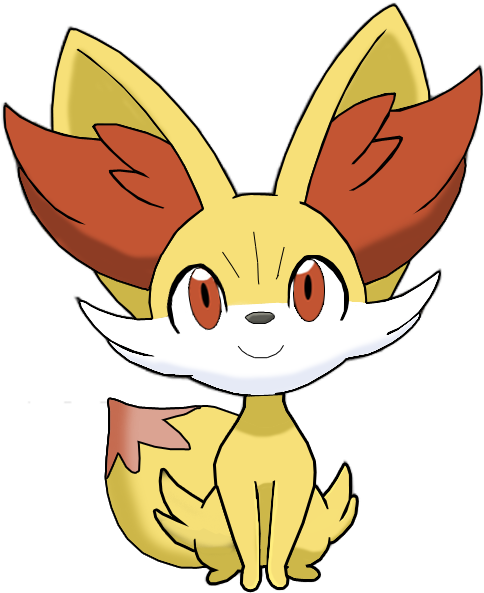

```{r setup, include=FALSE}

#llamado de librerias y base de datos

library(flexdashboard)
library(plotly)
library(tidyverse)
library(DT)
library(shiny)
library(readr)

Pokemons_G2 <- read_csv("C:/Trabajo final computación/Pokemons G2.csv")
```

# Inicio {data-icon="fa-bolt"} 

### Portada

<div align= "center">Univesidad Central de Venezuela
\
Facultad de Ciencias Económicas y Sociales
\
Escuela de estadística y ciencias actuariales
\
Cátedra: Computación</div> 


<h1 style="text-align: center;">Pokemons</h1>

<h4 style="text-align: center;">Trabajo Final</h4>

<div style="position: absolute; top: 0; left: 0;">
{width=70%}
</div>

<div style="position: absolute; top: 36%; left: 30%;">
{width=55%}
</div> 


\
\
\
\
\
\

<div align= "right">Grupo Nº2:
\
José Mendoza
\
Alirio Guerrero
\
Mariangel Arguello
\
C.I 31.813.137
</div> 

# Introducción {data-navmenu="Contenido" data-icon="fa-folder-open"}

## {data-width="500"}

### Introducción


### Regiones 

  
## {data-width="500"}

### Generaciones de pokemons 

```{r}

#clasificación de las generaciones en grupos de 3 

 Generation3 <- Pokemons_G2 [c(
1, 2, 3, 4, 5, 6, 7, 8, 9, 10, 11, 12, 13, 14, 15, 16, 17, 18, 19, 20, 21, 22, 23, 24, 25, 26, 27, 28, 29, 30, 31, 32, 33, 34, 35, 36, 37, 38, 39, 40, 41, 42, 43, 44, 45, 46, 47, 48, 49, 50, 51, 52, 53, 54, 55, 56, 57, 58, 59, 60, 61, 62, 63, 64, 65, 66, 67, 68, 69, 70, 71, 72, 73, 74, 75, 76, 77, 78, 79, 80, 81, 82, 83, 84, 85, 86, 87, 88, 89, 90, 91, 92, 93, 94, 95, 96, 97, 98, 99, 100, 101, 102, 103, 104, 105, 106, 107, 108, 109, 110, 111, 112, 113, 114, 115, 116, 117, 118, 119, 120, 121, 122, 123, 124, 125, 126, 127, 128, 129, 130, 131, 132, 133, 134, 135, 136, 137, 138, 139, 140, 141, 142, 143, 144, 145, 146, 147, 148, 149, 150, 151, 152, 153, 154, 155, 156, 157, 158, 159, 160, 161, 162, 163, 164, 165, 166, 167, 168, 169, 170, 171, 172, 173, 174, 175, 176, 177, 178, 179, 180, 181, 182, 183, 184, 185, 186, 187, 188, 189, 190, 191, 192, 193, 194, 195, 196, 197, 198, 199, 200, 201, 202, 203, 204, 205, 206, 207, 208, 209, 210, 211, 212, 213, 214, 215, 216, 217, 218, 219, 220, 221, 222, 223, 224, 225, 226, 227, 228, 229, 230, 231, 232, 233, 234, 235, 236, 237, 238, 239, 240, 241, 242, 243, 244, 245, 246, 247, 248, 249, 250, 251, 252, 253, 254, 255, 256, 257, 258, 259, 260, 261, 262, 263, 264, 265, 266, 267, 268, 269, 270, 271, 272, 273, 274, 275, 276, 277, 278, 279, 280, 281, 282, 283, 284, 285, 286, 287, 288, 289, 290, 291, 292, 293, 294, 295, 296, 297, 298, 299, 300, 301, 302, 303, 304, 305, 306, 307, 308, 309, 310, 311, 312, 313, 314, 315, 316, 317, 318, 319, 320, 321, 322, 323, 324, 325, 326, 327, 328, 329, 330, 331, 332, 333, 334, 335, 336, 337, 338, 339, 340, 341, 342, 343, 344, 345, 346, 347, 348, 349, 350, 351, 352, 353, 354, 355, 356, 357, 358, 359, 360, 361, 362, 363, 364, 365, 366, 367, 368, 369, 370, 371, 372, 373, 374, 375, 376, 377, 378, 379, 380, 381, 382, 383, 384, 385, 386
),]

Generation6 <- Pokemons_G2 [c(387, 388, 389, 390, 391, 392, 393, 394, 395, 396, 397, 398, 399, 400, 401, 402, 403, 404, 405, 406, 407, 408, 409, 410, 411, 412, 413, 414, 415, 416, 417, 418, 419, 420, 421, 422, 423, 424, 425, 426, 427, 428, 429, 430, 431, 432, 433, 434, 435, 436, 437, 438, 439, 440, 441, 442, 443, 444, 445, 446, 447, 448, 449, 450, 451, 452, 453, 454, 455, 456, 457, 458, 459, 460, 461, 462, 463, 464, 465, 466, 467, 468, 469, 470, 471, 472, 473, 474, 475, 476, 477, 478, 479, 480, 481, 482, 483, 484, 485, 486, 487, 488, 489, 490, 491, 492, 493, 494, 495, 496, 497, 498, 499, 500, 501, 502, 503, 504, 505, 506, 507, 508, 509, 510, 511, 512, 513, 514, 515, 516, 517, 518, 519, 520, 521, 522, 523, 524, 525, 526, 527, 528, 529, 530, 531, 532, 533, 534, 535, 536, 537, 538, 539, 540, 541, 542, 543, 544, 545, 546, 547, 548, 549, 550, 551, 552, 553, 554, 555, 556, 557, 558, 559, 560, 561, 562, 563, 564, 565, 566, 567, 568, 569, 570, 571, 572, 573, 574, 575, 576, 577, 578, 579, 580, 581, 582, 583, 584, 585, 586, 587, 588, 589, 590, 591, 592, 593, 594, 595, 596, 597, 598, 599, 600, 601, 602, 603, 604, 605, 606, 607, 608, 609, 610, 611, 612, 613, 614, 615, 616, 617, 618, 619, 620, 621, 622, 623, 624, 625, 626, 627, 628, 629, 630, 631, 632, 633, 634, 635, 636, 637, 638, 639, 640, 641, 642, 643, 644, 645, 646, 647, 648, 649, 650, 651, 652, 653, 654, 655, 656, 657, 658, 659, 660, 661, 662, 663, 664, 665, 666, 667, 668, 669, 670, 671, 672, 673, 674, 675, 676, 677, 678, 679, 680, 681, 682, 683, 684, 685, 686, 687, 688, 689, 690, 691, 692, 693, 694, 695, 696, 697, 698, 699, 700, 701, 702, 703, 704, 705, 706, 707, 708, 709, 710, 711, 712, 713, 714, 715, 716, 717, 718, 719, 720, 721),]

Generation9 <- Pokemons_G2 [c(722, 723, 724, 725, 726, 727, 728, 729, 730, 731, 732, 733, 734, 735, 736, 737, 738, 739, 740, 741, 742, 743, 744, 745, 746, 747, 748, 749, 750, 751, 752, 753, 754, 755, 756, 757, 758, 759, 760, 761, 762, 763, 764, 765, 766, 767, 768, 769, 770, 771, 772, 773, 774, 775, 776, 777, 778, 779, 780, 781, 782, 783, 784, 785, 786, 787, 788, 789, 790, 791, 792, 793, 794, 795, 796, 797, 798, 799, 800, 801, 802, 803, 804, 805, 806, 807, 808, 809, 810, 811, 812, 813, 814, 815, 816, 817, 818, 819, 820, 821, 822, 823, 824, 825, 826, 827, 828, 829, 830, 831, 832, 833, 834, 835, 836, 837, 838, 839, 840, 841, 842, 843, 844, 845, 846, 847, 848, 849, 850, 851, 852, 853, 854, 855, 856, 857, 858, 859, 860, 861, 862, 863, 864, 865, 866, 867, 868, 869, 870, 871, 872, 873, 874, 875, 876, 877, 878, 879, 880, 881, 882, 883, 884, 885, 886, 887, 888, 889, 890, 891, 892, 893, 894, 895, 896, 897, 898, 899, 900, 901, 902, 903, 904, 905, 906, 907, 908, 909, 910, 911, 912, 913, 914, 915, 916, 917, 918, 919, 920, 921, 922, 923, 924, 925, 926, 927, 928, 929, 930, 931, 932, 933, 934, 935, 936, 937, 938, 939, 940, 941, 942, 943, 944, 945, 946, 947, 948, 949, 950, 951, 952, 953, 954, 955, 956, 957, 958, 959, 960, 961, 962, 963, 964, 965, 966, 967, 968, 969, 970, 971, 972, 973, 974, 975, 976, 977, 978, 979, 980, 981, 982, 983, 984, 985, 986, 987, 988, 989, 990, 991, 992, 993, 994, 995, 996, 997, 998, 999, 1000, 1001, 1002, 1003, 1004, 1005, 1006, 1007, 1008, 1009, 1010, 1011, 1012, 1013, 1014, 1015, 1016, 1017),]

#creación de gráficos circulares 

fig <- plot_ly()

colors <- c('rgb(177,120,220)', 'rgb(102,48,144)', 'rgb(229,204,255)')

fig <- fig %>% add_pie(data = count(Generation3, generation), labels = ~generation, values = ~n,
           name = "Primeras 3", domain = list(x = c(0, 0.4), y = c(0.4, 1)),
           marker = list(colors = colors
                  ))

colors <- c('rgb(76,153,0)', 'rgb(204,255,153)', 'rgb(142,225,86)')

    fig <- fig %>% add_pie(data = count(Generation6, generation), labels = ~generation, values = ~n,
           name = "Las 3 del medio", domain = list(x = c(0.6, 1), y = c(0.4, 1)),                       marker = list(colors = colors))

colors <- c('rgb(165,32,32)', 'rgb(240,186,186)', 'rgb(255,153,153)')
        fig <- fig %>% add_pie(data = count(Generation9, generation), labels = ~generation, values = ~n,
           name = "Ultimas 3", domain = list(x = c(0.25, 0.75), y = c(0, 0.6)),
           marker = list(colors = colors))
        
fig <- fig %>% layout(title = "", showlegend = T,
           xaxis = list(showgrid = FALSE, zeroline = FALSE, showticklabels = FALSE),
           yaxis = list(showgrid = FALSE, zeroline = FALSE, showticklabels = FALSE))

fig
```

### Ejemplos de pokemons 

<div align= "left">Imagen de Squirtle
\
*Pokemon elemento agua*
  </div>
  
\
\
\
\
\
\
\
\
\

<div align= "right">Imagen de Fennekin
\
*Pokemon elemento fuego*
  </div> 
  
  
<div style="position: absolute; top: 30%; right:50%">
  {width=50%}</div>
  
<div style="position: absolute; top: 0%; left: 70%">
  {width=85%}</div>

# Base de datos {data-navmenu="Contenido" data-icon="fa-pencil"}

```{r}

#se inserta la base de datos, renombrando al español y excluyendo algunos valores

Pokemons <- Pokemons_G2 [,-c(15,16,18)]

datatable(Pokemons, options = list(order = list(list(0, 'asc'))), 
          rownames = FALSE, filter = "top", class = "compact",
          colnames = c("ID", "Nombres", "Rango", "Generación", "Evoluciona de", "Tipo 1", " Tipo 2", "Vida", "Ataque", "Defensa", "Ataque especial", "Defensa especial", "Velocidad","Total", "Habilidades"),
          caption = htmltools::tags$caption(
    style = 'caption-side: bottom; text-align: left;',
    "Base de Datos: ", htmltools::em("Esta tabla muestra todas las caracteristicas que se evaluaran en el trabajo."))
          )
```

