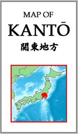

```{r setup, include=FALSE}

#llamado de librerias y base de datos

library(flexdashboard)
library(plotly)
library(tidyverse)
library(DT)
library(shiny)
library(readr)

Pokemons_G2 <- read_csv("C:/Trabajo final computación/Pokemons G2.csv")
```

# Inicio {data-icon="fa-bolt"} 

### Portada

<div align= "center">Univesidad Central de Venezuela
\
Facultad de Ciencias Económicas y Sociales
\
Escuela de estadística y ciencias actuariales
\
Cátedra: Computación</div> 


<h1 style="text-align: center;">Trabajo Final</h1>

<h4 style="text-align: center;">Presentación</h4>

<div style="position: absolute; top: 0; left: 0;">
{width=90%}
</div>

<div style="position: absolute; top: 28%; left: 30%;">
{width=55%}
</div> 

\
\
\
\
\
\
\
\
\
\
\
\

<div align= "right">Grupo Nº2:
\
José Mendoza
\
C.I 31.099.597
\
Mariangel Arguello
\
C.I 31.813.137
</div> 
# Introducción {data-navmenu="Contenido" data-icon="fa-folder-open"}

## {data-width="500"}

### Introducción
\
\
\
\
<div align= "justify">"Pokémon es una de las franquicias más grandes e influyentes de Nintendo. Con una historia que abarca más de veinte años" (Assunção et al., 2017). Su mundo contiene una serie de televisión, varias series de historietas, especiales televisivos, más de cincuenta videojuegos repartidos en varias de las consolas Nintendo y ahora también el mercado de las aplicaciones para celulares. Y su historia se remonta en Japón, país en dónde nace Satoshi Tajiri, que con apenas 25 años tuvo la idea de diseñar un sistema en el que varios jugadores pudieran interactuar en un mundo compartido. 
</div> 

### Regiones 

<div style="position: absolute; top: 0%; rigth: 85%">
{width=68%}</div> 


<div style="position: absolute; top: 0%; left: 70%">
{width=115%}</div> 
  
## {data-width="500"}

### Generaciones de pokemons 

```{r}

#clasificación de las 9 generaciones en grupos de 3 

Generation3 <- Pokemons_G2 [(1:386),]

Generation6 <- Pokemons_G2 [(387:721),]

Generation9 <- Pokemons_G2 [(722:1017),]

#creación de diagramas sectoriales  

fig <- plot_ly()

colors <- c('rgb(177,120,220)', 'rgb(102,48,144)', 'rgb(229,204,255)')

fig <- fig %>% add_pie(data = count(Generation3, generation), labels = ~generation, values = ~n,
           name = "Primeras 3", domain = list(x = c(0, 0.4), y = c(0.4, 1)),
           marker = list(colors = colors
                  ))

colors <- c('rgb(76,153,0)', 'rgb(204,255,153)', 'rgb(142,225,86)')

    fig <- fig %>% add_pie(data = count(Generation6, generation), labels = ~generation, values = ~n,
           name = "Las 3 del medio", domain = list(x = c(0.6, 1), y = c(0.4, 1)),                       marker = list(colors = colors))

colors <- c('rgb(165,32,32)', 'rgb(240,186,186)', 'rgb(255,153,153)')
        fig <- fig %>% add_pie(data = count(Generation9, generation), labels = ~generation, values = ~n,
           name = "Ultimas 3", domain = list(x = c(0.25, 0.75), y = c(0, 0.6)),
           marker = list(colors = colors))
        
fig <- fig %>% layout(title = "", showlegend = T,
           xaxis = list(showgrid = FALSE, zeroline = FALSE, showticklabels = FALSE),
           yaxis = list(showgrid = FALSE, zeroline = FALSE, showticklabels = FALSE))

fig
```

### Ejemplos de pokemons 

<div align= "left">Imagen de Squirtle
\
*Pokemon elemento agua*
  </div>
  
\
\
\
\
\
\
\
\
\

<div align= "right">Imagen de Fennekin
\
*Pokemon elemento fuego*
  </div> 
  
  
<div style="position: absolute; top: 30%; right:50%">
  {width=50%}</div>
  
<div style="position: absolute; top: 0%; left: 70%">
  {width=85%}</div>

# Base de datos {data-navmenu="Contenido" data-icon="fa-pencil"}

```{r}

#se inserta la base de datos, renombrando al español y excluyendo algunos valores

Pokemons <- Pokemons_G2 [,-c(15,16,18)]

datatable(Pokemons, options = list(order = list(list(0, 'asc'))), 
          rownames = FALSE, filter = "top", class = "compact",
          colnames = c("ID", "Nombres", "Rango", "Generación", "Evoluciona de", "Tipo 1", " Tipo 2", "Vida", "Ataque", "Defensa", "Ataque especial", "Defensa especial", "Velocidad","Total", "Habilidades"),
          caption = htmltools::tags$caption(
    style = 'caption-side: bottom; text-align: left;',
    "Base de Datos: ", htmltools::em("Esta tabla muestra todas las caracteristicas que se evaluaran en el trabajo."))
          )
```

# Problema {data-navmenu="Contenido" data-icon="fa-list" data-orientation=rows}

## {data-height="500"}

### Gráfico de barras por los elementos de cada pokemon según su tipo

```{r}

#se seleccionan las variables para trabajar este primer gráfico

x <- c('Acero', 'Agua', 'Bicho', 'Dragón', 'Eléctrico', 'Fantasma', 'Fuego', 'Hada', 'Hielo')
y1 <- c(35, 140, 83, 65, 58, 35, 66, 29, 36)
y2 <- c(29, 20, 9, 29, 10, 29, 15, 35, 17)
data <- data.frame(x, y1, y2)

fig <- plot_ly(data, x = ~x, y = ~y1, type = 'bar', name = 'Tipo 1', marker = list(color = 'rgb(181,131,206)'))
fig <- fig %>% add_trace(y = ~y2, name = 'Tipo 2', marker = list(color = 'rgb(237,201,255)'))
fig <- fig %>% layout(xaxis = list(title = "", tickangle = -45),
         yaxis = list(title = ""),
         margin = list(b = 100),
         barmode = 'group')

fig
```

### Gráfico de barras por los elementos de cada pokemon según su tipo *(continuación)*

```{r}

# se seleccionan las variables restantes para trabajar este segundo gráfico

x <- c('Lucha', 'Normal', 'Planta', 'Psíquico','Roca', 'Oscuridad', 'Tierra', 'Veneno', 'Volador')
y1 <- c(40, 117, 102, 60, 65, 45, 40, 46, 9)
y2 <- c(33, 13, 24, 40, 16, 24, 35, 41, 103)
data <- data.frame(x, y1, y2)

fig <- plot_ly(data, x = ~x, y = ~y1, type = 'bar', name = 'Tipo 1', marker = list(color = 'rgb(121,216,143)'))
fig <- fig %>% add_trace(y = ~y2, name = 'Tipo 2', marker = list(color = 'rgb(195,229,203)'))
fig <- fig %>% layout(xaxis = list(title = "", tickangle = -45),
         yaxis = list(title = ""),
         margin = list(b = 100),
         barmode = 'group')

fig
```

## {.tabset .tabset-fade data-height=500}

### Gráficos de dispersión entre la vida y la defensa y velocidad 

```{r}
fig <- plotly::plot_ly(Pokemons_G2, type = 'scatter')
fig <- plotly::add_trace(fig, x = ~hp, y = ~def, mode='markers', name=1, marker = list(color = 'pink', size = 5))
fig <- plotly::add_trace(fig, x = ~hp, y = ~speed, xaxis='x2', yaxis='y2', mode='markers', name=2,  marker = list(color = 'orange', size = 5))
fig <- plotly::layout(fig, xaxis2 = list(domain = c(0.6, 0.95), anchor='y2'),
         yaxis2 = list(domain = c(0.6, 0.95), anchor="x2"), xaxis = list(title = "Vida"),
    yaxis = list(title = "Defensa")) 

fig
```

### Gráfico de caja y bigotes evaluando el rango y el ataque 

```{r}

box_plot <- plot_ly(Pokemons_G2, x = ~rank, y = ~atk, type = 'box',
                            marker = list(color = 'rgb()',
                            outliercolor = 'rgba(56, 5, 241, 0.4)',
                            line = list(outliercolor = 'rgba(56, 5, 241, 0.6)',
                                        outlierwidth = 2))) %>% layout(boxmode = "group", xaxis =                                                 list(title = "Rango"),
                                       yaxis = list(title = "Ataque"))
box_plot
```

### Plantamiento y formulación del problema

<h6 style="text-align: center;">Plantamiento</h6>

<div align= "center"> En la franquicia de Pokémon cada generación trae nuevos objetos que se incorporan a los existentes o los reemplazan. Así, aparecen nuevas Poké Balls, nuevos artículos en las tiendas, nuevas máquinas técnicas y máquinas ocultas, etc.

 De la misma manera el objetivo del juego es  llegar a ganar la Liga Pokémon y convertirse en el campeón regional, es decir, convertirse en un maestro Pokémon, capturando, entrenando y evolucionando a estas criaturas para completar el Pokédex, que es un registro electrónico de todos los Pokémon conocidos, clasificando y archivando información tales como su nombres, sus descripciones, estadísticas físicas y especiales de la criatura atrapada o que ven en sus viajes.
 
 Dada la información suministrada anteriormente se propone un analisis detallado teniendo en cuenta los elementos más significativos para determinar las características de ataque que describen a todas las generaciones</div> 

<h6 style="text-align: center;">Formulación</h6>

<div align= "center">¿Cuáles son las características de ataque que describen a las 9 generaciones de pokemon, tomando en consideración los elementos más significativos de cada grupo?</div> 

### Objetivo general y Objetivos específicos 

<h6 style="text-align: center;">Objetivo general</h6>

<div align= "center">Analizar y comparar las cualidades de cada una de las generaciones de pokémon,
según su elemento principal, y características de ataque</div> 

<h6 style="text-align: center;">Objetivos específicos</h6>

<div align= "center">
1) Estudiar las características de cada tipo y generación de los pokemons 
2) Clasificar a los pokemons,  según su elemento principal, y características de ataque
3) Calcular y comparar las estadísticas descriptivas en cada grupo de pokemon
4) Determinar el elemento más representativo de cada generación de pokémon</div> 

# Referencias  {data-icon="fa-quote-left"} 


<div align= "center">Assunção, C., Brown, M., & Workman, R. (2017). Pokémon is evolving! An investigation into the development of the pokémon community and expectations for the future of the franchise. Press Start, 4(1), 17–35.

La evolución de Pokemón, [more info](https://es.gizmodo.com/la-evolucion-de-pokemon-en-sus-20-anos-de-historia-1761549098)

Generaciones de Pokémon, [more info](https://pokemon.fandom.com/es/wiki/Generaciones_Pok%C3%A9mon)

La historia de Pokemón, [more info](https://lafrikileria.com/blog/historia-pokemon-game-boy/)

Pokémon, [more info](https://issuu.com/espaciodiseno/docs/espacio_dise_o_282-283_dise_o_interactivo_y_videoj/s/12018932).</div> 


